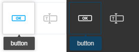

The Component Palette package.
=

This package is a part of FormBuilder technology powered by [Startapp.studio](https://www.startapp.studio).

Component Palette is a component for organizing building blocks of the HTML page. This component is intended for the visual design of the HTML form.
The component is fully customizable and has two embedded themes: light and dark

### Install

```bash
npm i @start-app/component-palette
```

### How to use.

```tsx
import { ComponentPaletteRegistry, IPaletteComponentDescriptor } from '@start-app/component-palatte';

// The component descriptor
const buttonDescriptor: IPaletteComponentDescriptor = { 
    name: 'button', title: 'Button', element: <span>Button</span> 
};

// The global component registry
const registry = new ComponentPaletteRegistry();

// Register the component in palette
registry.register(buttonDescriptor);

```

Component descriptor has an element field. This field shall contain a React component which will be displayed in the palette cell. 

We strongly recommend using SVG for your components icons. That provides a possibility to apply styling themes for the icons on the palette.

Something like this.



### Render the component.
```tsx
import { 
    lightTheme,
    ComponentPaletteRegistry,
    ComponentPallette
} from '@start-app/component-palatte';

const paletteTheme = lightTheme;
const registry = new ComponentPaletteRegistry();

function render() {
    return (
        <ComponentPallette
            theme={paletteTheme}
            registry={registry}
            onDragStart={(event, name) => this.dragStart({event, name})}>
        </ComponentPallette>
    );
}
```
onDragStart event has the name parameter that contains the name of the dragged component.

### License
MIT
